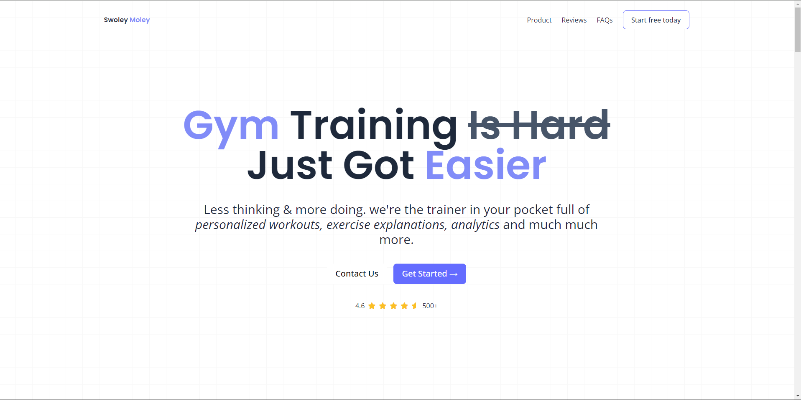

<h1 align="center">Gym Landing Page</h1>

<p align="center">This project is a website that displays a Landing Page for a Gym using Svelte</p>

---

<br>

### Detail

<h1 align="center">
  
  
</h1>

## 📱 Features

- Create a layout using Tailwindcss
- Responsive website
- Built with Svelte framework

## 🚀 Technologies & Resources

- [x] [Svelte](https://svelte.dev/docs/introduction)
- [x] [Tailwindcss](https://tailwindcss.com/docs/installation)

## 💻 Installation

1. #### Clone the repository:

   ```bash
   git clone https://github.com/fadhildwia/gym-app-landingpage-svelte.git
   ```

2. #### Navigate to the project directory:

   ```bash
   cd gym-app-landingpage-svelte
   ```

3. #### Install the dependencies:
   ```bash
   yarn
   #or
   npm install
   ```
4. #### Run the project:
   ```bash
   yarn dev
   #or
   npm run dev
   # or start the server and open the app in a new browser tab
   npm run dev -- --open
   ```

<!-- ## License

This example application is licensed under the [MIT License](LICENSE).

--- -->

---

Feel free to explore the code and adapt it to suit your needs! If you encounter any issues or have suggestions for improvements, please don't hesitate to open an issue or submit a pull request.
